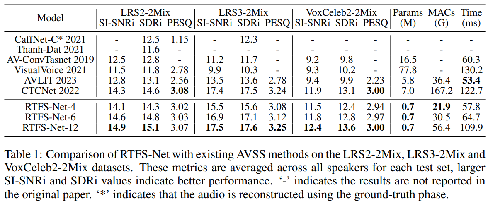
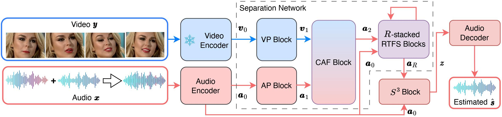
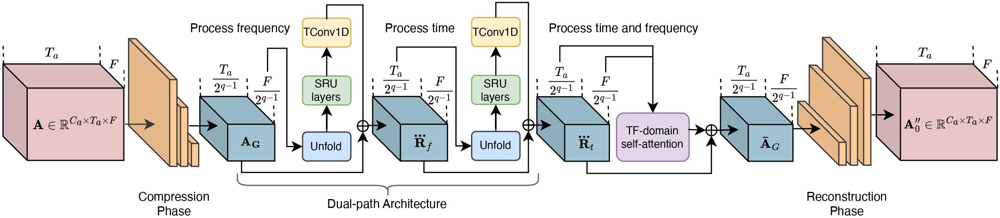

______________________________________________________________________

<div align="center">

# RTFS-Net: Recurrent time-frequency modelling for efficient audio-visual speech separation

[](https://arxiv.org/abs/2309.17189)
[](https://anonymous.4open.science/w/RTFS-Net/AV-Model-Demo.html)

</div>

Welcome to the official GitHub repository of [RTFS-Net](https://arxiv.org/abs/2309.17189), accepted by ICLR 2024.

# Introduction

## Problem:
The 'cocktail party problem' highlights the difficulty machines face in isolating a single voice from overlapping conversations and background noise. 

### Issues with Current Audio-Visual Speech Separation Methods:
- **T-domain Methods:** These offer high-quality audio separation but suffer from high computational complexity and slow processing due to their extensive parameter count.
- **TF-domain Methods:** More efficient in computation but historically underperform compared to T-domain methods. They face three key challenges:
  1. Lack of independent modeling of time and frequency dimensions.
  2. Insufficient use of visual cues from multiple receptive fields for enhancing model performance.
  3. Poor handling of complex features, leading to loss of critical amplitude and phase information.

### Proposed Solution: Recursive Time-Frequency Separation Network (RTFS-Net)
- **Approach:** Integrates audio and high-fidelity visual cues using a novel TF-domain method.
- **Innovations:**
  1. **RTFS Blocks:** Compress and independently model acoustic dimensions (time and frequency), minimizing information loss while creating a low-complexity subspace.
  2. **Cross-dimensional Attention Fusion (CAF) Block:** Efficiently fuses audio and visual information for enhanced voice separation while utilizing 1.3% the computational complexity of the previous SOTA method.
  3. **Spectral Source Separation ($S^3$) Block:** Effectively extracts the target speaker's voice features using complex numbers.
 
## Results and Comparison

Comparison of RTFS-Net with existing AVSS methods.



The dataflow of RTFS-Net is described below. See our [paper](https://arxiv.org/abs/2309.17189) for more details.


The red and blue solid lines signify the flow directions of auditory and visual features respectively. The snowflake indicates the weights are frozen and the component is not involved in training. 

The core of RTFS-Net is the dual path core architecture shown below, named "RTFS Blocks".

After compressing the data to a more efficient size, we process first the frequency dimension, then the time dimension, then both dimensions in tandem using TF-domain self-attention to capture inter-dependencies. We then carefully restore the data to its original dimensions using our Temporal-Frequency Attention Reconstruction units.

## Paper Abstract

Audio-visual speech separation (AVSS) methods aim to integrate different modalities to generate high-quality separated speech, thereby enhancing the performance of downstream tasks such as speech recognition. Most existing state-of-the-art (SOTA) models operate in the time domain. However, their overly simplistic approach to modeling acoustic features often necessitates larger and more computationally intensive models in order to achieve SOTA performance. In this paper, we present a novel time-frequency domain AVSS method: Recurrent Time-Frequency Separation Network (RTFS-Net), which applies its algorithms on the complex time-frequency bins yielded by the Short-Time Fourier Transform. We model and capture the time and frequency dimensions of the audio independently using a multi-layered RNN along each dimension. Furthermore, we introduce a unique attention-based fusion technique for the efficient integration of audio and visual information, and a new mask separation approach that takes advantage of the intrinsic spectral nature of the acoustic features for a clearer separation. RTFS-Net outperforms the previous SOTA method using only 10\% of the parameters and 18\% of the MACs. This is the first time-frequency domain AVSS method to outperform all contemporary time-domain counterparts.

## Installation

Before you begin, ensure you have [Miniconda](https://docs.conda.io/en/latest/miniconda.html) installed on your system. Then, follow these steps:

1. Clone this repository to your local machine:
   ```bash
   git clone https://github.com/spkgyk/RTFS-Net.git
   cd RTFS-Net
   ```

2. Create a Conda environment with the required dependencies using the provided script:
   ```bash
   source setup/conda_env.sh
   ```
   If you are in Mainland China, please follow the comments in the `setup/requirements.yaml` file.

**Note:** AVSS is a GPU-intensive task, so make sure you have access to a GPU for both installation and training.

## Datasets & Pretrained Video Model

1. Please download the pretrained video module used in our experiments by visiting [CTCNet](https://github.com/JusperLee/CTCNet)'s official repository. Instructions for downloading the various datasets used in our paper are also there, along with some additional scripts and utils for running the models in various real-world situations. 

2. Once the datasets are downloaded and formatted, please run the relevent scripts in the `data-preprocess` folder, i.e.
   ```bash
   python preprocess_lrs2.py --in_audio_dir audio/wav16k/min --in_mouth_dir mouths --out_dir LRS2
   python preprocess_lrs3.py --in_audio_dir audio/wav16k/min --in_mouth_dir mouths --out_dir LRS3
   python preprocess_vox2.py --in_audio_dir audio/wav16k/min --in_mouth_dir mouths --out_dir VOX2
   ```

## Training & Evaluation

Training the AVSS model is a straightforward process using the `train.py` script. You can customize the training by specifying a configuration file and, if necessary, a checkpoint for resuming training. Here's how to get started:

1. Run the training script with a default configuration file:
   ```bash
   python train.py --conf-dir config/lrs2_RTFSNet_4_layer.yaml
   ```

2. If you encounter unexpected interruptions during training and wish to resume from a checkpoint, use the following command (replace the checkpoint path with your specific checkpoint):
   ```bash
   python train.py --conf-dir config/lrs2_RTFSNet_4_layer.yaml \
   --checkpoint ../experiments/audio-visual/RTFS-Net/LRS2/4_layers/checkpoints/epoch=150-val_loss=-13.16.ckpt
   ```

Feel free to explore and fine-tune the configuration files in the `config` directory to suit your specific requirements and dataset.

To train all the models, please use the run script provided:
```bash 
bash run.sh
```

Use the `test.py` script for evaluating your trained model on the test set. For examples, again see `run.sh`.

## Acknowledgements

This implementation contains code from the [Asteroid](https://github.com/asteroid-team/asteroid) GitHub.

## Citations

If you find this code useful in your research, please cite our work:
```
@article{pegg2023rtfs,
  title={RTFS-Net: Recurrent Time-Frequency Modelling for Efficient Audio-Visual Speech Separation},
  author={Pegg, Samuel and Li, Kai and Hu, Xiaolin},
  journal={arXiv preprint arXiv:2309.17189},
  year={2023}
}
```